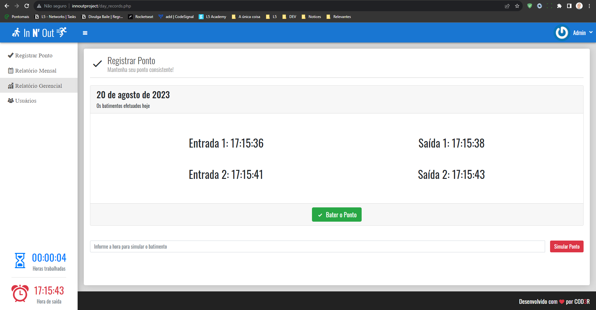

## Curso de PHP 7 | Cod3r - Udemy

### Projeto de conclusão do curso.



- [Mais informações sobre o curso:](https://www.udemy.com/course/php-7-completo/)

<hr>

## Detalhes de configuração do ambiente para quem usa o wamp64:

### Config server

#### Exemple:

- File: C:\wamp64\bin\apache\apache2.4.46\conf\extra\httpd-vhosts.conf

```bash
# Virtual Hosts
#
<VirtualHost *:80>
  ServerName localhost
  ServerAlias localhost
  DocumentRoot "${INSTALL_DIR}/www"
  <Directory "${INSTALL_DIR}/www/">
    Options +Indexes +Includes +FollowSymLinks +MultiViews
    AllowOverride All
    Require local
  </Directory>
</VirtualHost>

#
<VirtualHost *:80>
	ServerName innoutproject
	DocumentRoot "C:\wamp64\www\innout\public"
	<Directory  "C:\wamp64\www\innout\public">
		Options +Indexes +Includes +FollowSymLinks +MultiViews
		AllowOverride All
		Require local
	</Directory>
</VirtualHost>
```